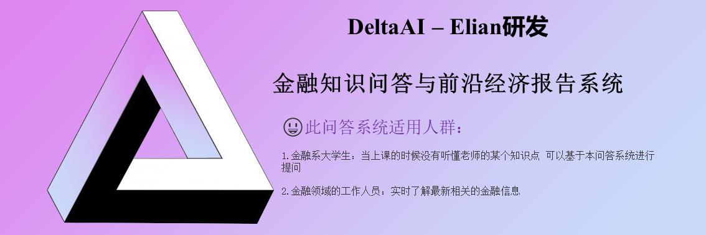

<!-- markdownlint-disable first-line-h1 -->
<!-- markdownlint-disable html -->
<!-- markdownlint-disable no-duplicate-header -->

<div align="center">
  
</div>
<hr>
<div align="center" style="line-height: 1;">
  <a href="http://deltaai.top/"></a>
  <a href="https://chat.deepseek.com/"></a>
  <a href="https://huggingface.co/deltaai"></a>
  <br>
  <a href="https://discord.gg/Tc7c45Zzu5"></a>
  <a href="https://github.com/deepseek-ai/DeepSeek-V2/blob/main/figures/qr.jpeg?raw=true"></a>
  <a href="https://twitter.com/deepseek_ai"></a>
  <br>
  <a href="https://github.com/deepseek-ai/DeepSeek-V3/blob/main/LICENSE-CODE"></a>
  <a href="https://github.com/deepseek-ai/DeepSeek-V3/blob/main/LICENSE-MODEL"></a>
  <br>
  <a href="https://arxiv.org/pdf/2412.19437"><b>Our Elian Paper Link</b>👁️</a>
</div>

# 智能金融系统V1版本

:sun_with_face:我们主要是设计一个金融知识问答的系统 以金融基础知识为根基 扩展大量的实时金融信息作为语料库 方便用户及时了解相关的金融信息

:earth_africa:数据来源：维基百科、金融系本科教育教科书、国际金融分析组织、金融类前沿论文与报告

 :smiley:此问答系统适用人群：

- 金融系大学生：当上课的时候没有听懂老师的某个知识点 可以基于本问答系统进行提问
- 金融领域的工作人员：实时了解最新相关的金融信息

## 技术路线
:mortar_board:因为问答这一块主要是回答的知识要准确且符合实时金融的特点，所以本文采用了RAG+LLM(SFT+RL)的技术来实现。

### 1.1 数据来源

数据收集有很多的痛点：

- 维基百科爬取下来的内容比较零散 虽然具有一定的知识 但知识面过于零散
- 网上下载下来的pdf数据 大部分都是影印版 需要额外的OCR识别
- 部分的前沿论文与报道 来自于国外 需要英文翻译文档 

我们将维基百科与中国课本上的知识作为金融基础知识 以最新前沿论文与报告作为语料库

#### :speech_balloon:维基百科

  :eyes:我们爬取了维基百科经济学的页面分类

- :egg:金融学：金融经济学 / 证券 / 货币 / 金融工程学 / 金融理论
- :egg:劳动经济学：人事经济学 /劳动力全球化 / [基本收入](https://zh.wikipedia.org/wiki/Category:基本收入) 
- :egg:发展经济学 ：[贫困研究](https://zh.wikipedia.org/wiki/Category:贫困研究)  / [可持续发展](https://zh.wikipedia.org/wiki/Category:可持续发展) /  [中国经济发展模式](https://zh.wikipedia.org/wiki/Category:中国经济发展模式)  / [展望五國](https://zh.wikipedia.org/wiki/Category:展望五國) /  [經濟發展](https://zh.wikipedia.org/wiki/Category:經濟發展) / [贫困测量与定义](https://zh.wikipedia.org/wiki/Category:贫困测量与定义) 
- :egg:微观经济学： 不确定经济学 / [信息、知识与不确定性](https://zh.wikipedia.org/wiki/Category:信息、知识与不确定性) / [商品](https://zh.wikipedia.org/wiki/Category:商品) / [市場 (經濟學)](https://zh.wikipedia.org/wiki/Category:市場_(經濟學))  / [彈性 (經濟學)](https://zh.wikipedia.org/wiki/Category:彈性_(經濟學)) / [微观经济学理论](https://zh.wikipedia.org/wiki/Category:微观经济学理论) / [微观经济行为的基本原则](https://zh.wikipedia.org/wiki/Category:微观经济行为的基本原则) / [成本](https://zh.wikipedia.org/wiki/Category:成本) / [收入分配](https://zh.wikipedia.org/wiki/Category:收入分配)  / [福利經濟學](https://zh.wikipedia.org/wiki/Category:福利經濟學) / [行为经济学](https://zh.wikipedia.org/wiki/Category:行为经济学) / 
- :egg:投资：[金融市场](https://zh.wikipedia.org/wiki/Category:金融市场) / [投资银行业](https://zh.wikipedia.org/wiki/Category:投资银行业) / [投资管理](https://zh.wikipedia.org/wiki/Category:投资管理) / [估值](https://zh.wikipedia.org/wiki/Category:估值) / [基础设施投资](https://zh.wikipedia.org/wiki/Category:基础设施投资) / [市場趨勢](https://zh.wikipedia.org/wiki/Category:市場趨勢) / [投资策略](https://zh.wikipedia.org/wiki/Category:投资策略)  / 私人股权投资 / [资本](https://zh.wikipedia.org/wiki/Category:资本) /  [银行存款](https://zh.wikipedia.org/wiki/Category:银行存款) / 投资学
- :egg:政治经济学： [后工业社会](https://zh.wikipedia.org/wiki/Category:后工业社会) / [人口经济学](https://zh.wikipedia.org/wiki/Category:人口经济学) / [军事工业复合体](https://zh.wikipedia.org/wiki/Category:军事工业复合体) / [政府财政](https://zh.wikipedia.org/wiki/Category:政府财政) /  [马克思主义经济学](https://zh.wikipedia.org/wiki/Category:马克思主义经济学) / 

:eyes:然后我们使用爬取下来的数据 基于NebulaGraph构建知识图谱

构建知识图谱我们使用NebulaGraph(安装它的方法请详见NebulaGraph.md)

<font color=blue>知识图谱构建这一块还需要逐步完善 我不太了解 只是简单的构建了一下(还是使用csv吧...)</font>


#### :speech_balloon:书籍

金融学专业本科阶段的核心课程分为三类

- :pencil:第一类：**宏观金融类课程** --> 主要有宏观经济学、货币金融学、国际金融学、保险学、中央银行学、金融监管学、会计学、计量经济学、国际经济学、金融学、保险学、期权、期货、股票学等；
- :pencil:第二类：**微观金融类课程** --> 主要有微观经济学、金融市场学、证券投资学、商业银行管理学、投资银行学、公司金融、金融工程、行为金融学等；
- :pencil:第三类：**工具类课程** --> 主要有固定收益证券、金融风险管理、国际结算等

此外，我们还收集了一些其他金融领域相关的基础书籍共计100本。（<font color=blue>注意：因为有很多书涉及到版权问题 所以这些数据本项目中进行了脱敏 但是仍然保留了一部分书籍 给大家学习使用</font>）


#### :speech_balloon:前沿论文与报告

- :pencil:**论文**：我们还收集了一些经济相关的前沿论文 以进行实时的金融行情分析 但大多数这些论文都是英文的 因此 我们这里多了一个翻译模型进行转换 (已脱敏)

- :pencil:**财政报告**：我们还爬取了大量的财政报告 这个目的也是为了进行实时的金融行情分析

- :pencil:**翻译**：https://github.com/Ding-Kyoma/EasyTrans-mac 我们采用了该仓库的功能进行pdf文档翻译(如果是大批量的文档翻译 注意一下api的钱!~很烧钱)

  <font color=blue>此部分数据进行了脱敏，但每个部分都保留了一部分数据给兄弟们学习使用</font>


### 1.2 分档分块
:gift_heart:在RAG（Retrieval-Augmented Generation）任务中，Chunk切分是一个关键步骤，尤其是在处理结构复杂的PDF文档时。PDF文档可能包含图片、奇怪的排版等，增加了Chunk切分的难度。

下面我们从几个不同的角度分析一下RAG的切分注意事项：

 :jack_o_lantern:Chunk粒度的影响
				句子/单词粒度：注重局部、关键信息的查询，但可能缺失上下文信息。
				长篇段落/文章粒度：Embedding结果反映整个文章的意思，但难以精准到个体单词。

 :jack_o_lantern:不同场景的Chunk分块粒度
				微博：少字符，适合较小的Chunk粒度。
				知乎/小红书：中小量字符数，适合中等Chunk粒度。
				博客：超多字符，适合较大的Chunk粒度。
				专业性较强、专有名词较多的文章或书籍：需要较小的Chunk粒度以保留专业信息。
				综述类信息总结文章：适合较大的Chunk粒度以保留整体信息。

 :jack_o_lantern:Chunk切分对信息的影响
				上下文信息：例如，《统计学习的要素》这本书有18章，每章专注于一个主题，副标题和第二层副标题等。人们习惯于在语境中理解文章。
				位置信息：文本的权重取决于它们在文档中的位置。文档开头和结尾的文字比中间的文字更重要。
				连续的信息：一个故事可能以“in the beginning”开头，然后以“then”、“therefore”、“after that”继续，直到以“finally”结尾。使用分块策略，这种连接可能不再完整。
				描述信息：使用分块，可能无法保证描述性信息集中在一起。

 :jack_o_lantern:确定最佳分块策略的因素
				被索引内容的性质：处理较长的文档（如文章或书籍）还是较短的内容（如微博或即时消息）？
				使用的Embedding模型：例如，sentence-transformer模型在单个句子上工作得很好，但像text-embedding-ada-002这样的模型在包含256或512个tokens的块上表现得更好。
				用户查询的长度和复杂性：用户输入的问题文本是简短而具体的还是冗长而复杂的？
				检索结果的使用方式：用于语义搜索、问答、摘要或其他目的？底层连接的LLM的tokens限制也会影响分块的大小。
总之，没有最好的分块策略，只有适合的分块策略。为了确保查询结果更加准确，有时候需要选择性地使用几种不同的策略。

 :jack_o_lantern:回到本文的书籍切分方法
				我们采用层次化动态分块（Hierarchical Dynamic Chunking） 	Llamaindex中的HierarchicalNodeParser


### 1.3 嵌入模型
 :beers:我们采用 bge-base-zh-v1.5 进行微调

<font color=red> 注意：如果后续使用微调的reranker模型 这里也使用微调的嵌入模型 整体性能会下降 详见注意事项的2.1</font>

```python
# 如何从modelscope上下载模型？

1.首先进入到modelscope上查看你想要的模型
	假设这里我查看的是beg-large： https://modelscope.cn/models/BAAI/bge-large-zh-v1.5
    
2.安装modelscope

3.down模型
	modelscope download --model BAAI/bge-large-zh-v1.5 --local_dir modelscope/raw_bge-large
    BAAI/bge-large-zh-v1.5是https://modelscope.cn/models/BAAI/bge-large-zh-v1.5 models后面的内容
    modelscope/raw_bge-large 是你下载到本地的哪里
```


:beers:HuggingFace地址：https://huggingface.co/BAAI/bge-base-zh-v1.

:beers:微调参考：https://github.com/FlagOpen/FlagEmbedding/tree/master/examples/finetune/embedder

具体步骤详见：bge微调.md


### 1.4 检索模型

检索模型的性能主要受“索引”和“嵌入器”的影响。为此，本项目设计对多种检索器的组合进行了消融实验分析，以得到性能最佳的检索器。

:chart:混合检索模型：语义检索 + 关键字 + 稀疏检索

:chart:对于混合检索算法：我们给出了三种 倒数排序融合算法 / 加权分数合并 / 多数投票机制

:a:最后，我们对检索器以及检索算法进行了评估（采用BEIR进行评估）,我们检索器的评估性能如下表：

​																								**表1：初步消融实验，以倒数排序融合算法作为基础**

|         方法/评估指标         |            NDCG@1            |            NDCG@5            |           NDCG@10            |            MAP@1             |  MAP@5   |            MAP@10            |             R@1              |             R@5              |             R@10             |             P@1              |             P@5              |             P@10             |
| :---------------------------: | :--------------------------: | :--------------------------: | :--------------------------: | :--------------------------: | :------: | :--------------------------: | :--------------------------: | :--------------------------: | :--------------------------: | :--------------------------: | :--------------------------: | :--------------------------: |
|        vec + bge-small        |             0.22             |             0.18             |             0.17             |             0.02             |   0.04   |             0.05             |             0.02             |             0.06             |             0.08             |             0.24             |             0.16             |             0.13             |
|      vec + bge-small-sft      |             0.07             |             0.04             |             0.04             |            0.006             |  0.007   |            0.009             |            0.006             |            0.009             |             0.01             |             0.07             |             0.04             |             0.04             |
|     vec+keyword+bge-small     |             0.23             |             0.19             |             0.19             |             0.02             |   0.05   |             0.06             |             0.02             |             0.06             |             0.10             |             0.24             |             0.16             |             0.15             |
|   vec+keyword+bge-small-sft   |             0.07             |             0.05             |             0.11             |           **0.06**           |  0.007   |             0.02             |            0.006             |            0.009             |             0.08             |            0.007             |            0.004             |             0.12             |
|   vec+keyword+bm5+bge-small   |           **0.34**           |           **0.26**           |           **0.26**           | <font color=blue>0.03</font> | **0.06** |           **0.08**           | <font color=blue>0.03</font> |           **0.09**           |           **0.14**           |           **0.35**           |           **0.23**           |           **0.20**           |
| vec+keyword+bm5+bge-small-sft | <font color=blue>0.29</font> | <font color=blue>0.23</font> | <font color=blue>0.24</font> | <font color=blue>0.04</font> | **0.06** | <font color=blue>0.07</font> |           **0.04**           | <font color=blue>0.07</font> | <font color=blue>0.13</font> | <font color=blue>0.30</font> | <font color=blue>0.20</font> | <font color=blue>0.19</font> |

**加粗代表sota性能，**<font color=blue>蓝色代表次优性能。</font>

从表1分析得到：微调之后的Embedder总体上都比不微调Embedder的效果差。但有个非常奇怪的现象：当加入了稀疏检索的时候，微调后的Embedder的性能在某些指标上达到了sota。因此，**本团队得出了一个结论：微调之后的Embedder最好搭配稀疏索引来进行检索，效果会达到最佳**。

为了证明我们的猜测，我们后续又对vec + bm25 进行了实验，实验结果如下：

- 源Embedder

​		{'NDCG@1': 0.35294, 'MAP@1': 0.03358, 'Recall@1': 0.03358, 'precision@1': 0.36842}
​				{'NDCG@5': 0.28252, 'MAP@5': 0.06907, 'Recall@5': 0.09816, 'precision@5': 0.24396}
​				{'NDCG@10': 0.26527, 'MAP@10': 0.0828, 'Recall@10': 0.13587, 'precision@10': 0.20093}

- 微调Embedder

​		{'NDCG@1': 0.40402, 'MAP@1': 0.04739, 'Recall@1': 0.04739, 'precision@1': 0.41796}
​				{'NDCG@5': 0.30996, 'MAP@5': 0.08401, 'Recall@5': 0.10055, 'precision@5': 0.25697}
​				{'NDCG@10': 0.26096, 'MAP@10': 0.08995, 'Recall@10': 0.12337, 'precision@10': 0.16873}

出了R@10和P@10指标没有打败源Embedder，其余的指标均达到了sota。为此，我们后续选择vec + bm25作为混合检索器base，继续对排序融合算法 / 加权分数合并 / 多数投票机制进行消融，实验结果如下：

​																								**表2：以base为基础 对排序算法进行消融**

|        方法/评估指标        |  NDCG@1  |  NDCG@5  | NDCG@10  |  MAP@1   |  MAP@5   |  MAP@10  |   R@1    |   R@5    |   R@10   |   P@1    |   P@5    |   P@10   |
| :-------------------------: | :------: | :------: | :------: | :------: | :------: | :------: | :------: | :------: | :------: | :------: | :------: | :------: |
|     base+bge-small+rrf      |   0.35   |   0.28   |   0.27   |   0.03   |   0.07   |   0.08   |   0.03   |   0.10   |   0.14   |   0.37   |   0.24   |   0.20   |
|   base+bge-small-sft+rrf    |   0.40   |   0.31   |   0.26   | **0.05** |   0.08   |   0.09   | **0.05** | **0.10** |   0.12   | **0.42** |   0.26   |   0.17   |
|   base+bge-small+combine    |   0.35   |   0.29   |   0.29   |   0.03   |   0.07   |   0.09   |   0.03   |   0.09   | **0.15** |   0.37   |   0.26   | **0.23** |
| base+bge-small-sft+combine  | **0.41** | **0.33** | **0.31** | **0.05** | **0.09** | **0.10** | **0.05** | **0.10** | **0.15** | **0.42** | **0.28** | **0.23** |
|   base+bge-small+majority   |   0.34   |   0.27   |   0.22   | **0.05** |   0.07   |   0.08   | **0.05** |   0.08   |   0.09   |   0.35   |   0.22   |   0.14   |
| base+bge-small-sft+majority |   0.16   |   0.10   |   0.08   |   0.02   |   0.03   |   0.03   |   0.02   |   0.03   |   0.03   |   0.16   |   0.08   |   0.05   |

从表2的结果来看，我们的结论是正确的，vec + bm25 + 微调的Embedder性能在加权分数合并上均达到了sota。因此，后续我们使用vec+bm25+微调Embedder+加权合并法作为检索器执行后续的任务。


### 1.5 重排序模型

coherererank + 长上下文重排序 + beg-微调的reranker 三者为一体的混合模型 -->待更新ing

### 1.6 响应模型
响应模型这里准备用DS-V3 基于RL进行一波训练(或者是来一波蒸馏！) 更符合我们金融领域的知识问答  -->待更新ing


## 注意事项

### 2.1 微调embedder和reranker

本人是bge的深度使用者，完成了embedding、reranker的部署、推理、微调全链路跑通与评测，目前发现一个问题，提出来，供大家思考：
首先给出我的数据结论，关键数据已脱敏处理，一个箭头代表5%提升或下降，提升或下降是指与【只embedding不reranker】做对比：

```python
baseline: only embedding
微调前embedding+微调前reranker叠加使用：↑
微调前embedding+微调后reranker叠加使用：↑↑
微调后embedding+微调前reranker叠加使用：↓
微调后embedding+微调后reranker叠加使用：↓↓↓
```

也就是说，对于微调后的embedding效果而言，叠加reranker会导致效果更差，我个人感觉是：同样的微调方式（难负例），微调后的reranker效果跟不上embedding的效果，导致叠加会变坏。
	后来，我针对reranker的微调方式进行修改再尝试，具体是将难负例挖掘的向量模型切换成我微调后的embedding模型（之前用的都是微调前的），结果发现了一个更令人震惊的事情，不管我怎么修改reranker训练数据：拆条/不拆条，增加neg数量从15->100，无一例外，训练loss全部不再收敛，训练后模型推理丧失多样性，所有的输出全部为同一个值。

简单来说，就是基于【微调前bge_embedding模型】挖掘难负例的训练数据集，同时训练embedding和reranker，单独看两者和微调前的模型对比，效果都会有提升，但是，叠加使用，即先向量粗召回再重排序后，召回效果会降低，即不如单纯向量粗召回的效果，叠加reranker后会不升反降。

我在考虑这个问题时，想的原因是，应该基于微调后的embedding再一次挖掘难负例，然后训练reranker，结果，更恐怖的事情发生了，这样训练后的reranker丢失了多样性，所有的输出score都是一个值或者近似一个值。没搞清楚为什么，我自认为我的数据应该没有问题


## 后续开发版本

- V2版本：会增加股票分析预测功能。
- v3版本：会增加金融股票图表生成与分析功能。
- v4版本：会增加财务报告撰写与财务报表总结功能。

